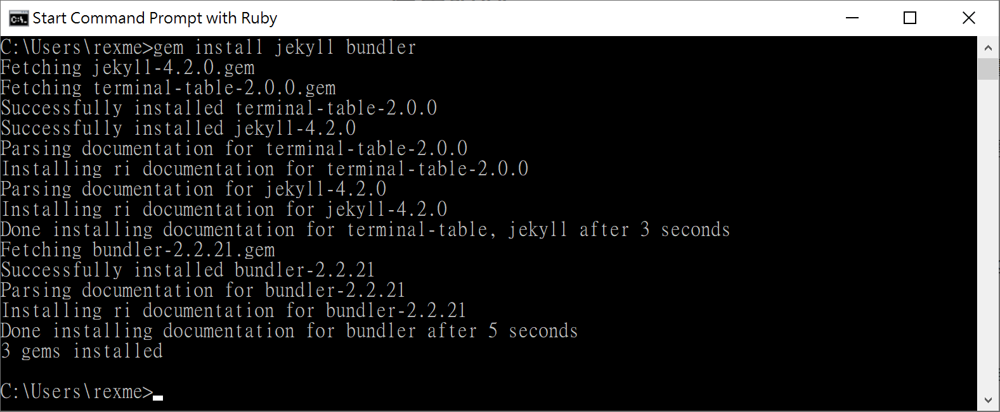
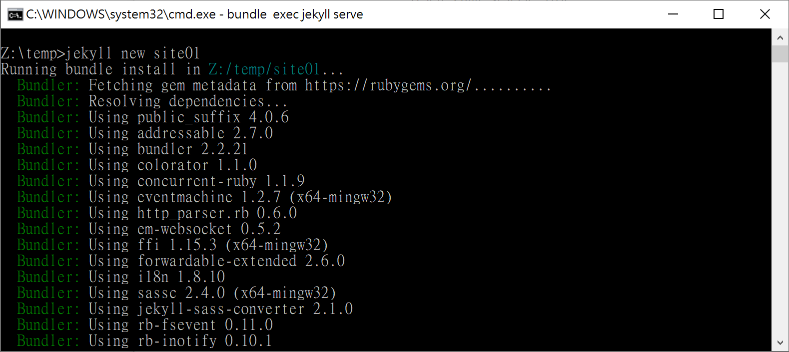
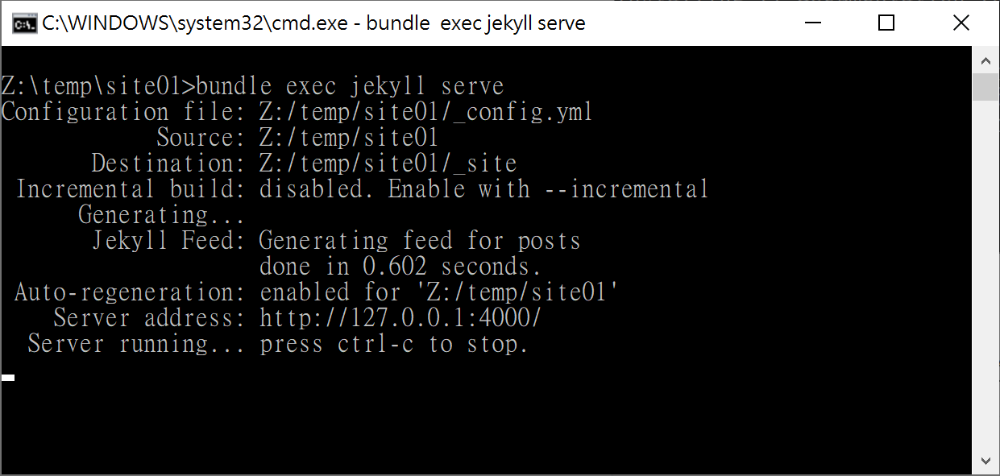
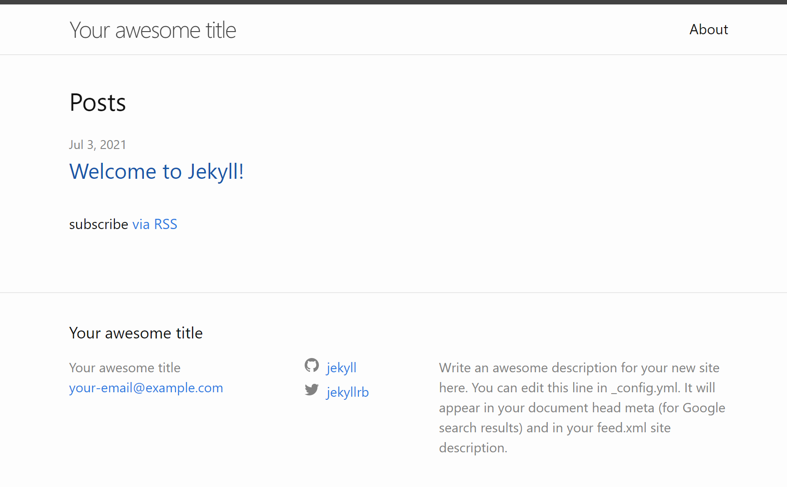
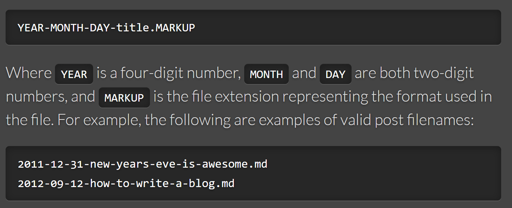
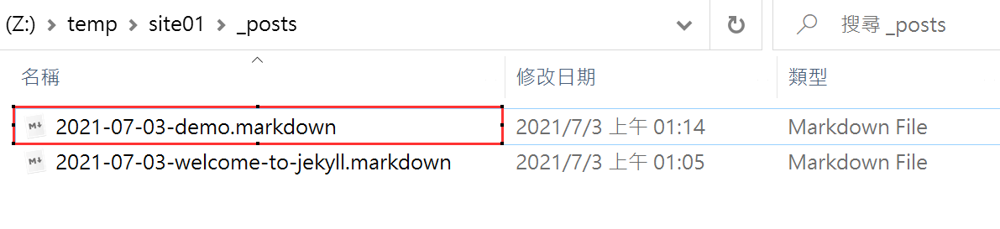
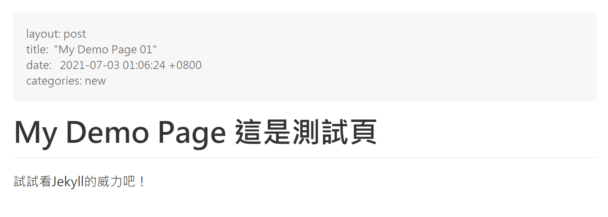
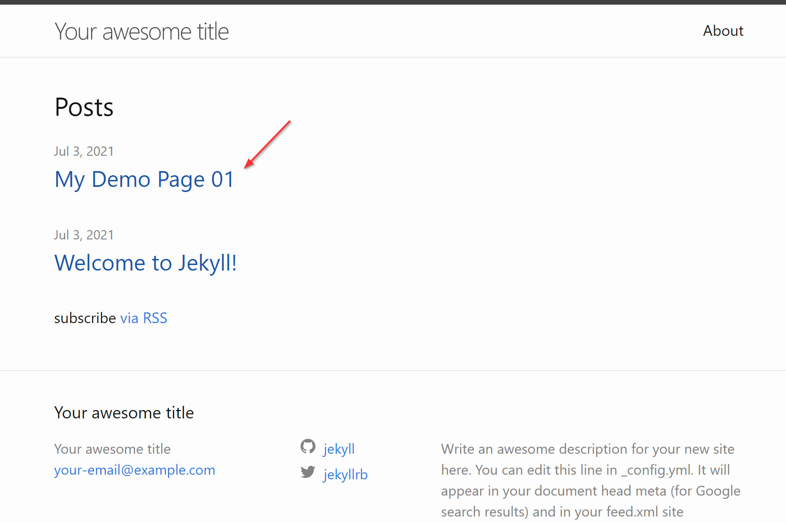

# 用Jekyll搭配GitHub Pages來寫Blog

### 什麼是GitHub Pages

GitHub Pages是GitHub網站透過免費的公開儲存庫(public repository)來建立網頁，並且可輕鬆改變網站主題風格，也可打造專屬的404錯誤頁面，還能使用HTTPS的安全防護 (但如果使用自己申請的domain就要額外自行申請SSL憑證)。簡言之，就是透過GitHub Pages的擴充性，讓原本作為程式碼管控的儲存庫，搖身一變也能成為一個個人網站。GitHub並且貼心的提供了對應的公開網址給使用者，當然若是你有自己申請的網址，還可進行指定，省去了租雲端主機的龐大費用。


### GitHub Pages的類型

GitHub Pages類型主要分為Project或個人/組織，前者針對特定的project來綁定，後者則針對個人或組織的帳號綁定。

以一般用戶為例，其網站網址會以`<username>.github.io`的規範來作使用，因此GitHub用戶需要在其帳號下建立一個名為`<username>.github.io`的repository。而最後的瀏覽網址即是`http(s)://<username>.github.io`

### 要怎麼進行網站內容更新與撰寫？

當然，使用GitHub的服務，必然需使用Git來作個人網頁的內容發佈，因此需要學會使用Git的技巧是免不了的。GitHub Pages提供了主要兩種方式來撰寫網站文件，一是大家所熟知的html，另一個則是寫code者必懂的markdown。(歡呼~)

### 依不同類型來發佈專案目錄

若是以個人/組織而言，網站會擺在repository的預設branch的根目錄下，但如果想要針對不同主題開設不同的子目錄，可以透過project + 特定branch name來達成。以project而言，則是需要開設一個`gh-pages` branch，將網站置於其根目錄下。使用者也可以調整設定，將目錄改放在任何branch的`/docs`之下。

若是在任一個repository之下要建立GitHub Pages，除了上述提到需建立`gh-pages` branch外，最後的瀏覽網址會是：`https://<username>.github.io/<repository>`

### 使用靜態網站生成器

GitHub Pages僅支援使用靜態的內容，因此不能把GitHub Pages當成server-side動態網站來使用。而官方推薦使用Jekyll來作為靜態網頁產生器的應用(內建支援，也可以改掉不使用)，可以透過Jekyll在GitHub Pages上打造個人的部落格。

### 使用限制

原則上GitHub Pages的repository使用限制建議為1GB以下 ，而流量每月限制為100GB。(以上為軟性限制，若超過會有一些警告通知信或網站可能無法正常運作)

另外，GitHub Pages並非設計用來讓使用者作商業用途使用，這點需要遵守。

### 什麼是Jekyll呢？


Jekyll是一個靜態網站產生器(static website generator)，而且GitHub Pages有內建支援 (但版本需符合)。透過Jekyll可以快速建立類似blog的內容網站 (可使用Markdown撰寫)，再上傳至Github Pages更新頁面。

科普一下，Jekyll本身是由GitHub的聯合創辦人Thomas Preston-Werner使用Ruby語言所寫，因此和GitHub使用上很合拍可不是沒有原因的。

#### 安裝Jekyll

首先說，Jekyll是一種Ruby Gem套件，因此事先在本機端安裝好Ruby (2.5.0以上)。

請到Ruby官網進行適合你的平台與版本下載：https://www.ruby-lang.org/zh_tw/downloads/

安裝步驟請參考官網介紹或其他網路文章，在此不多解釋。

如果安裝成功後，可於Terminal環境使用gem進行安裝。需安裝jekyll以及bundler。

以我的windows為例，裝完Ruby後請使用cmd進行以下指令安裝所需套件

```
gem install jekyll bundler
```



#### 開始建立第一個Jekyll站台

第一步，先使用jekyll new指令建立新的站台，先到你要建立的根目錄下指令

```
jekyll new site01
```



建立好後，進入新建的site目錄，再接著使用bundle指令將site啟動 (注意，指令後面是serve，不是server)

```
bundle exec jekyll serve
```

註：如果執行上述指令，出現以下錯誤：

```
in `require': cannot load such file -- webrick (LoadError)
```

因為Ruby 3.0之後，不會再webrick綁定在Ruby中，因此需手動進行新增webrick的指令：

```
bundle add webrick
```

註2：若出現以下錯誤訊息：

```
Please add the following to your Gemfile to avoid polling for changes:
    gem 'wdm', '>= 0.1.0' if Gem.win_platform?
```

則需要在Gemfile中新增該行



則可以到上述網址看一下Jekyll幫我們建立的靜態網站的模樣



#### 依樣畫葫蘆建一個新的頁面

上面可以看到在站台建立後，會有一個"Welcome to Jekyll"示範的頁面，他就放在Site目錄的_posts底下，快速以這個檔案作為template複製一份出來改一改作為新的頁面吧。

在jekyll裡要特別注意到的是檔案名命規則，官網說明如下：



因此，就照他的規則，先把文章日期和文章標題命好，這裡的名稱僅方便作者管理即可，實際上會顯示在首頁的名稱並不是從這裡而讓的，但這裡的名稱會出現在URL網址列上，因此還是不要命的和實際內文差太遠比較好。



打開markdown檔案後，在最上方有個重要的表頭資訊，將title與date、categories改為自己想要的，並行自行調整內文。



接著再回到剛剛的首頁去看一下變化



新增的頁面就會在這裡出現了，這裡有個地方可以留意一下，文章的排序是愈新的排在愈上方，其實就是以剛剛在markdown上方的表頭資訊中的`date`的時間作為順序，可以稍為調整一下其值，讓他比本來Welcome to Jekyll的時間還舊，重新整理首頁就會發現兩則的順序交換了。

我們還可以觀察一下，由本機的Jekyll執行指令會產生一個`_site`目錄，其中即為靜態網站內容，這個就是Jekyll運作完後的輸出。不過，如前面所提，GitHub Pages也支援Jekyll，因此我們接下來就是要將我們本機的jekyll原碼(包含.md檔等)更新到GitHub上，GitHub上會自動運作即時產生`_site`目錄。因此，在本機端這個`_site`目錄是不需要上傳上去的。在本機端執行，純粹只是要在本機先驗證內容均無誤，可以被Jekyll正常解析與產生靜態網頁。

#### 用Git更新到GitHub上吧

接下來，我們就可以將本機目錄和GitHub上的已建立好的repository作關聯。在本機的repo中使用git remote等相關指令與GitHub上的repo作好關聯設定，再將本機端的檔案push上去。

因此，當你撰寫完文章或者有任何修正異動，則可透過git的add、commit、push指令作更新，隨後就可以看到使用Jekyll產生的靜態網頁在自己的GitHub Pages上囉！(大概需要等個1分鐘才會更新)

當然，你在所看到的這篇文章也是透過這個方式完成的，不過還有些如何換Jekyll主題樣板，待之後有空再來補充。