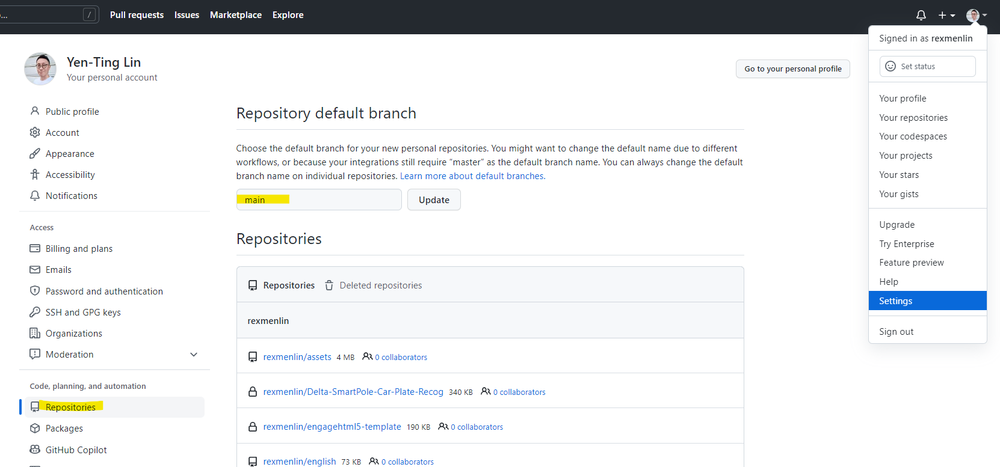

# 超入門Git筆記 (1)

這篇文章並非要撰寫又一篇全新的Git教學，因為網路上已經有很多從基礎關聯開始講解為何需要版控軟體，以及Git與各種集中式管理的版控軟體前輩們的差別，這裡就不去解釋了。

這篇文章是寫給已經對Git有一定基礎的了解的讀者，漸進式的說明各種指令與情境作法之整理筆記。

## Git 文件庫 (Repository)

Git Repository (簡稱Repo)為一個可以儲存以Git作版控的文件庫存在儲存空間。雖然Git是分散式的版控軟體，但依據工作的模式，可以簡單分為本地端(Local)與遠端(Remote)兩種模式。因此無論是否需要多人協作，或是自己想要在多台電腦隨時可無縫工作的情況下，均可先在Local Repo進行管理，有需要再和Remote Repo進行同步。其他協作者或者自己的其他電腦，即可和遠端的Repo進行更新，以達成多人或多工作裝置的版控目標。

**本地端Local Repo**

可用於個人的文件管理(即使身在一個團隊中)，因此即使沒有使用遠端管理的狀態下，也能僅使用本機的Local Repo來達到個人版控。使用前當然需要安裝Git軟體，可至官網下載與安裝。

我們在本地端的某個目錄想作Git版控，必須要做的事是讓此目錄初始化為Git可識別的目錄。因此可執行以下的指令：

```jsx
git init
```

當完成後，此目錄(含以下)就具備Git的環境了，接下來，這個目錄會多出一些隱藏目錄.git，則表示該目錄已擁有Git的版控能力了。

這時候就可以使用查詢Git狀態的指令確認：

```
git status
```

# 文件的異動版控管理

## 文件提交 (Commit)

當文件進行修改後，想在該階段進行一個紀錄，以便未來可進行重要參考或回溯等目的，則可使用commit指令製作一個提交點。不過並非三不五時作一點點異動就要打一個commit，這個感覺與定義雖然沒有一定的標準，但大概是一個小範圍完整的功能完成時，可進行一個commit並註記這個提交的主要原因是什麼。(例如，是為了增加哪個功能，或修改哪個問題等等)

每一次的commit，都會在Git裡面留下記錄，包含是何時由誰提交的commit，或者可簡單從註記中了解這個commit提交的原因。

### 在進行提交前，先設定使用者資訊

當該電腦進行第一次commit時，若尚未設定git user資訊，則會要求執行資訊的填寫，但這個動作只需要作一次。

請依指令提供Email與使用者名稱

```jsx
git config --global user.email "you@example.com"
git config --global user.name "Your Name"
```

以上加上—global參數，讓這個設定僅用於此repository。

若要查詢目前設定的使用者，則使用—list參數 (或-l)

```jsx
> git config --global --list
user.email=rexlin@example.com
user.name=Rex Lin
```

### 還是不能Commit呀！少了「add」指令

當我們進行commit時，還是無法成功，我們可以先使用查詢狀態的指令查看一下。

```jsx
git status
```


該訊息說明，目前有文件但仍是「untracked」(未追蹤)狀態，因此尚未能直接進行提交，要提交前，需先進行「add」指令，才能將文件或檔案移至「stage」的狀態，這個才是可進行commit的文件對象。

### Git文件狀態簡單說

簡單說一下，在Git控管的目錄，一開始所有檔案都是在untracked (未追蹤)的狀態，而這個區域意即工作目錄(working directory)。而當開始有檔案的異動時，Git會偵測的到並會進入modified狀態。當「有被異動，且想要進行版控的文件」，才需要「追蹤」與管理它們。因此接下來就是要將這些檔案，移至下一個追蹤的狀態，我們稱之為「staged」。而在stage中的狀態 (即放置於Staging Area)，還不會直接受到Git的版控，需要將他們明確的「提交」(commit)後，才會成為一個正式的版控紀錄點，意即放入Git Repository區。

[Working Directory] **Untracked狀態** --> [Staging Area] **Staged狀態** --> [Git Repository] **Tracked狀態**

### 來點add檔案指令，放入Staging Area

```jsx
git add test.txt
```

若僅需針對特定檔案進行add，則直接在後面輸入檔名。若想直接將所有該目錄下的所有文件(包含子目錄)都一起add，則僅需加上一個點作為參數。

```jsx
git add .
```

再進行一次status查詢


則會看到該檔案已在staged狀態了。

了解git的檔案狀態變化後，就知道為何需要先作add指令了。如上述所提，必須要經由add指令，才能讓在工作目錄中的標檔被標記成為staged狀態，Git會為他產生一個索引，在後續將此索引的檔案再提交到Repository後，才能擁有實質被有效版控的能力。

### 補充技巧：取消追蹤某些檔案

可使用以下指令對已放入stage待commit的檔案進行取消追蹤(unstage)，用於不小心add錯檔案或想反悔時使用。

```
git rm --cached <file>
```

如果要將目前所有stage的檔案都反悔取消，則使用wildcard

```
git rm --cache *
```

執行完後，可再使用git status查看目前狀況。

### 終於可以Commit了吧

當進行完以上流程後，就可以針對想要提交的檔案進行commit指令了。

```jsx
git commit -m <提交內容>
```

注意，若不加-m，則會開啟預設的Vim Editor (或在Install時可選擇慣用的Editor)進行「提交訊息撰寫」。若加上-m，則可直接在指令中輸入提交的訊息。

> -m後，可加上雙引號、單引號、直接輸入字串(但不能空格，要空格必須使用引號)，甚至直接緊接著-m的m撰寫都可以。不過某些環境下使用單引號會有問題，例如windows cmd命令列，因此建議使用**雙引號**。

### 補充技巧: 修改最後一次commit說明內容

只要在commit中，加上參數—amend指令，即可修改最後一次commit指令。

```
git commit --amend -m <新的內容>
```


不過要注意的是，重新對最後一次提交作說明的修改，是會被複製出來產生一個新的commit index，所以並非能船過水無痕。而原本的commit則會被流放，等待Git的GC機制啟動時，就有可能被回收。

## 聊聊遠端Git Repo

當使用了遠端Remote Repo後，一來是可以和他人分享文件，或是自己個人有多台工作電腦可隨時同步工作進度，再來當然是為了多人協作為目標，讓彼此之間的文件可有統一管理及版控的交換與同步的機制。

目前有蠻多公有雲的Remote Git Repo的服務平台可直接選擇，例如GitHub、GitLab或BitBucket等。

### 幾種本地與遠端同步管理的情境

* 原本就有一個本地端的Repo在運行，突然想要和建立一個遠端Repo來同步管理 (使用git remote add)
* 全新的一個專案，而且一開始就想要有直接放一份在遠端Repo (其實操作方式和上面很接近)
* 我加入一個別人已在運作的專案，要把遠端的程式碼抓回來本地端 (使用git clone)

### 如何與遠端的repo作連接 (以GitHub為例)

在GitHub開一個新的repo後，會有一段說明告訴你如何在本機端下指令，和GitHub的遠端Repo作連接。

你會在GitHub的這個Repo中取得GitHub的HTTPS的.git連結URL (也有SSH的使用方式)，作法如下。可回到local端的command line執行以下指令。

當然，前提是你的本地端Repo已經準備好了，若還沒，則請用前面的git init將一個本地端的目錄先作好Git初始化。再來執行以下指令。

```jsx
git remote add origin https://github.com/rexmenlin/test.git
git branch -M main
git push -u origin main
```

上述指令，透過remote add與遠端的repo作新增連接，而「origin」則是給這個遠端repo起一個連線名稱，通常照慣例，會將這個遠端的連線名稱命作origin。當然，可以不要取作origin，而是任何其他名稱。但這是一個機乎約定俗成的命名方式，建議不要改動較能和各個開發者接軌。比較不會造成不必要的認知誤會。

而第二行，是將本地的branch透過-M，改名稱為main。在說明與使用branch (分支) 前，就會遇到一個問題，就是Git和現行GitHub的預設分支的名稱不太一樣。在GitHub中的預設branch通常名為main；使用Git在local端建立的repo的預設branch通常名為master。因此這行指令有一點像是，為了怕兩端的預設branch不同，因此GitHub提供的連線範本，讓你也把本地端的branch先改為main，才能一致。

而最後一個push指令，則是指，指定遠端repo origin這個地方，將本地分支的檔案推送到遠端的main分支上。

設定-u (--set-upstream) 指的是將先設定為預設的連線位置與主要分支，以後就不用再打一次origin main了。只要打`git push`即可。

### 補充：調整GitHub預設Branch名稱

因為本地的預設branch為master，與GitHub的預設分析main不相同，若不想變更本地的branch名稱為main。可以到GitHub上，修改組織的預設branch名稱。將main改回一般Git通用的master也行。

從個人的Settings > Repositories中修改



### 查詢遠端Repo

當完成上述指令建立好本地與遠端的連線設定後，可查詢目前git連接到的遠端Repo。

```jsx
git remote
git remote -v
```

加上-v參數，則可看到該名稱連接到的URL為何。

```jsx
origin https://github.com/rexmenlin/test.git (fetch)
origin https://github.com/rexmenlin/test.git (push)
```

若要看更詳細的內容，則可使用下列指令：(加上show)

```
> git remote show origin
* remote origin
  Fetch URL: https://github.com/rexmenlin/test.git
  Push  URL: https://github.com/rexmenlin/test.git
  HEAD branch: main
  Remote branch:
    main tracked
  Local branch configured for 'git pull':
    main merges with remote main
  Local ref configured for 'git push':
    main pushes to main (up to date)
```

### 將結果推送到遠端Repo中

當執行完commit後，即可再度執行push指令。

```jsx
git push
```

因為剛剛已經使用git push -u origin main進行過第一次的推送，因此git會記住這個狀態。之後再使用push指令時，後面的參數就不需要再設定。

## 有關remote add與clone的差別

當我們有一個遠端的Repo，以及本地端的位置，相要同步這兩邊的git，可能會使用到git remote add或者git clone，但兩者有何差別呢？

### 情境1 想建立一個新的遠端Repo，把本地端的Code連接

這個時候，你要使用的是remote add指令。也就是順序是你先有本地端的Repo後，想找一個遠端Git Repo，並把本地端的code上傳。

因此，你在本地端，已事先作過git init了，並且在遠端(例如GitHub上)開好Repository。

```
git remote add origin https://github.com/rexmenlin/test.git
```

因此只要再進行push指令將本地端的code上傳後，兩邊就同步狀態了。

### 情境2 有一個遠端已存在的Repo，但本地是不存在的，想同步這些Code回來

此時，要使用的是git clone指令。在進行這個作業前，是不需要事先作git init的！因為clone指令會完整的將遠端Repo直接複製一份回來本地端。

```
git clone https://github.com/rexmenlin/test.git
```

而且，上述指令不需要特別指令遠端的Repo名稱(例如origin)。

當clone指令把遠端Repo在本機端完整建立後，後續的更新，要從遠端取得檔案回來本地，就不會再使用clone指令了。就會使用pull (連同merge一起作) 或fetch (只下載但不主動作merge)。

### 將遠端的內容更新回來本地端

上述提到了將本地端推送上去遠端的push指令，也有從遠端把資料第一次複製回來的clone指令 (通常clone只會在最初始時用一次而已)，接下來就是淺淺介紹兩個指令 pull與fetch，可在後續將遠端的新狀態更新回來本地端。

#### Pull與Fetch指令

Pull指令是將有比本地端repo還要新的內容下載回來，並且有相同檔名的話會直接進行merge的動作。

```
git pull
```

因此pull指令等同於fetch + merge，雖然這裡還沒提到merge是什麼，但可以先理解就是兩個以上的人若有修改同一份檔案，勢必要進行合併。合併內容若沒有改到相同的行數，則可順利把兩份檔案有差異的地方融合成一份，但如果不幸的改動到的是相同內容的話，就會造成merge衝突(conflict)，則需要針對文件內容作取捨與調整後，才能完成這個合併的動作。

# Branch分支管理

## 如何開新的branch

branch的概念與時機，就是在主線(master)之外，為了增加新功能、修改bug等時，為保險起見，可以先開立一個新的分支來做這些功能或動作，不要直接在master上操作。

通常的作法，master主線只是用來打發行的版本用的(配合後續會提到的tag指令)，因此開發用途的branch，可命名作develop。而從develop中，再長出各種我們因為新功能，分配給不同人去開發的支線，通常會叫feature。一種命名樣式為feature/feature name，例如"feature/login"或"feature/add-cart"。這只是一個易於識別的作法，並非強制規定，有一些GUI的工具，會將feature以及其斜線後的子功能，可以在UI工具上自動收合成2階的呈現方式，讓管理上較為方便。另外也有在上線之前的最終放行測試版本的支線release等，都會依開發實務習慣而有所不同。

### 確定目前的branch

使用下列指令，可查詢現有的branch

```jsx
git branch
```

### 建立新的branch

使用以下指令，可建立新的branch，但是建立完成時，active branch仍然會留在原本的branch中，不會直接切換過去。

```jsx
git branch <new_branch_name>
git branch newfunc1
```

此時，可以再進行git branch指令查詢，會看到多了一個branch。


### 使用checkout切換branch

因此，要在不同branch之中切換，需要使用checkout指令。

```jsx
git checkouut newfunc1
```


此時可看到active branch切換到newfunc1了。

使用checkout指令進行branch的切換，也可以checkout到任何一個commit的node位置，只要在checkout的後方輸入commit index即可(最少輸入前面4碼即可)。不過要注意的是，當我們目前指向的位置，脫離原本的branch的點位時，會發現指位的特殊HEAD標記會出現。其實HEAD一直都存在，只不過若剛好HEAD指的地方恰好是branch的位置，部份的GUI工具會隱藏其顯示。但若使用command line的話，都可以清楚看到目前的HEAD落在哪一個commit節點中。

> 實際上，HEAD的指位，若是恰好在branch上時，其實實際上是HEAD先指在branch上，branch再指在某個commit點上。因此我們如果直接移動HEAD到別的commit點時，則會造成HEAD與branch分離。

### 省時小技巧

若想要建立一個新的branch，也順便切換到這個新的branch，我們可以直接使用checkout指令，並加上-b參數。小提醒，下面的指令是"checkout加上參數-b"，不是"branch加上參數-b"。

```jsx
git checkout -b newfunc2
```

### 刪除branch

使用以下指令刪除branch，但必須記得，不能刪除目前的current branch。若要刪除，要先checkout到別的branch中。

```jsx
git branch -d newfunc2
```

### Branch的進階操作

當我們開了一個新的branch，以上述newfunc1為例，我們可以新增一些檔案的異動。並且進行add/commit後，接下來若我們要暫時回到原本的主線(或develop支線，為簡化說明，以下均以master為例)，只要checkout回master即可。checkout回去後，可看到原本在newfunc1修改的內容，會被倒回到原本沒有修改的狀態。

可以使用以下指令，查詢commit的狀態。

```jsx
git log --oneline
```


其中可以看到，目前有兩個branch： master與newfunc1。但我們因為已checkout到newfunc1，所以目前有三次的提交，HEAD會指在最新的地方。


若原先有一個檔案test.txt，原本只有三行，我們加上第四行。並進行add與commit。


上述的log指的是，目前有四次提交，而HEAD指在這裡，並且branch名為newfunc1。可看到master是停留在第三次提交上。

### 倒回主線的狀態

所以我們可以checkout到master上面，再打開test.txt看其內容。

```jsx
git checkout master
type test.txt
```


在checkout回master後查看log，會看到在這條線上是看不到newfunc1 branch的。

### 直接移動branch的commit點

若我們想直接將任一個branch的commit點直接跳到另一個commit點，可使用branch -f的指令達成：

```
git branch -f <branch name> <commit index>
git branch -f master 06fe
```

### 來merge內容吧

我們當初開設newfunc1的目的，就是為了在其他分支中撰寫一些新的東西而暫不影響主線內容。當我們已經確認完新內容時，就可以使用merge的功能把新內容整合回主線中。

要記得，merge的用法，是以「較早期內容者的branch，去merge新內容branch」

因此，我們想要把新的newfunc1的內容，整合回master，是要checkout到master去下merge指令的。

```jsx
git merge newfunc1
```


此時可以看到，我們將newfunc1的內容merge回到master了。在master中，可以看到test.txt的內容有第四行。

因此，newfunc1 branch若是認為功成身退無需使用，可進行branch的刪除動作。不過這個也是工作團隊的習慣或約定，有些是發生過的branch仍然要留著一段時間，這個並無標準作法。但當然branch過多是會造成管理的問題，因此可設定好一個branch退場方式。

```jsx
git branch -d newfunc1
```


## 還沒談到的部份

以下先紀錄一下還沒談到的進階部份

* 出版打tag
* reset與revert
* conflict的時候怎麼辦
* merge、rebase、cherry-pick
* 相對引用 ^與~的用法
* stash暫存