# Docker Desktop安裝筆記 (Windows版本)

使用Docker時，無論你使用Windows或macOS，多少都會聽說過要安裝具備UI功能的Docker Desktop。雖然前先日子Docker開始提出了Docker Desktop的收費方案，但是對於個人使用而言是仍不受影響的。對於想要使用Pro功能的個人、團隊開發或大型企業而言 (超過250位員工，或收年入在USD$10M的企業)，若有需要，則需使用付費方案來繼續獲取Docker Desktop的使用授權。


這篇會一步一步說明如何在Windows上安裝Docker Desktop，就讓我們看下去吧。

首先，你只要到Docker的[官網](https://www.docker.com/)裡  ，第一頁就是會引導你安裝Docker Desktop這套軟體，請依照自己慣用的作業系統進行安裝，因為雷哥我只有Windows電腦，因此這篇就只會撰寫Windows的安裝流程與手順。


## 開始安裝Windows版Docker Desktop

點選畫面中的download按鈕，則會開始進行下載。

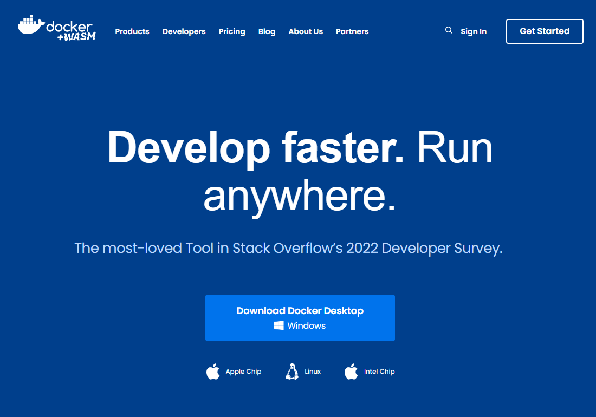

待下載完成後，點選`Docker Desktop Installer.exe`執行檔後，則會出現下列安裝前的設定畫面。預設會推薦我們使用WSL 2來提供我們Windows環境必要的Linux核心子系統相容介面。(我目前的版本是4.13.1版)

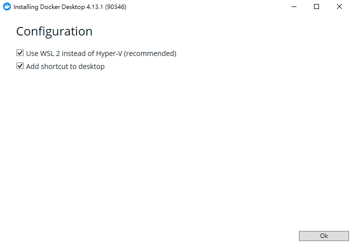

點選`ok`後，開始安裝。

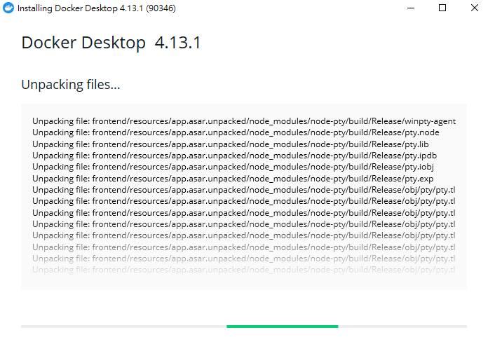

安裝完成後，則只會有一個關閉按鈕。

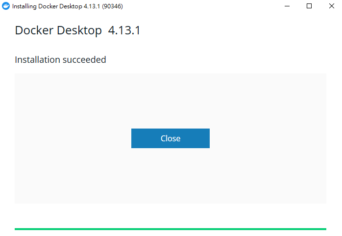

接著在Windows中找到你剛安裝好的Docker Desktop，並行執行。看到相當可愛的圖案，有各種相關系統或語言的吉祥物們，畫面是一片詳和呀！但這樣就能開始使用Docker 了嗎？？

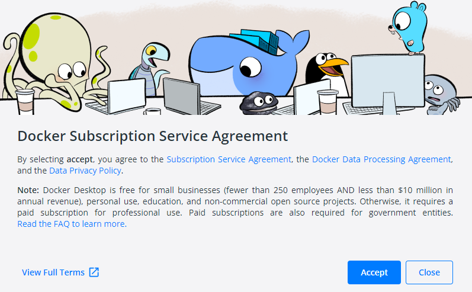


### 等等，才剛裝好怎麼有Warning圖示！

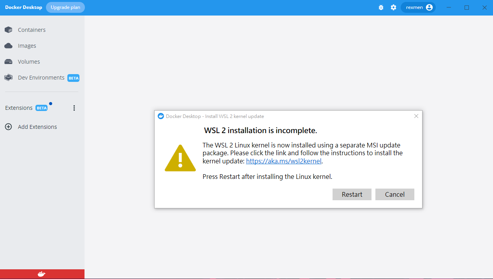

當我們順利打開Docker Desktop軟體後，也順利的看到斗大的黃色Warning圖示，是哪裡出了問題嗎？訊息告訴我們，WSL 2的安裝並未完成。只給了我們下面的網址，要我們照指示進行Linux核心的安裝，並且告知如果完裝完了後，再回來這裡按`restart`。

https://aka.ms/wsl2kernel

點開網址後，會連到微軟的WSL官網教學頁，直接幫我們連結到舊版手動安裝的Step 4教學頁。

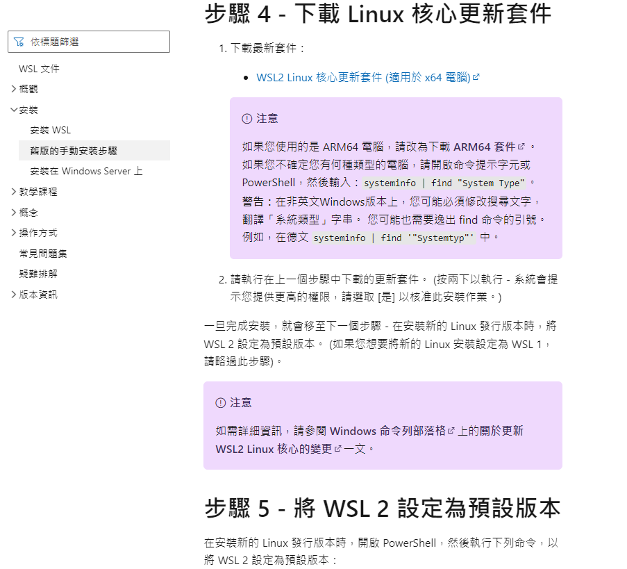

點選頁面上的[連結](https://wslstorestorage.blob.core.windows.net/wslblob/wsl_update_x64.msi) ，則會進行`wsl_update_x64.msi`安裝檔的下載流程。下載好後，直接點選進行安裝。

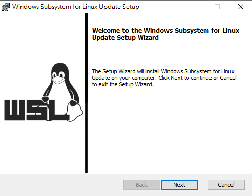

直接點選`Next`，安裝好後則可點選`Finish`結束作業。

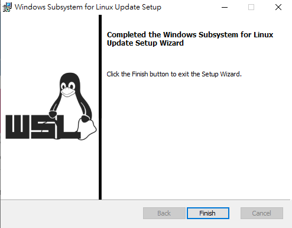

此時我們只裝WSL底層安裝好，但仍然缺少實際的Linux運行版本。

可透過PowerShell進行以下指令查看訊息

```
wsl
```

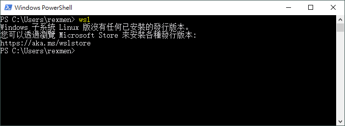

上述訊息可得知雖然WSL指令可運作了，但裡面沒有實際的Linux發行版本，訊息提示我們要去Microsoft Store上安裝。


### 將WSL 2設為預設版本

我們若仍在剛剛的微軟教學網頁，先把第5步驟先完成，即為將WSL 2設定為預設的版本。

```
wsl --set-default-version 2
```

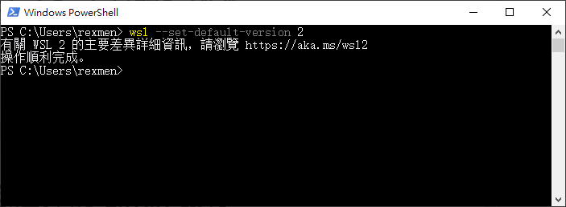


### 接著安裝Linux發行版本

接著，我們繼續微軟官網的步驟6，挑選一個Linux發行版本，我們就挑Ubuntu 22.04版好了。

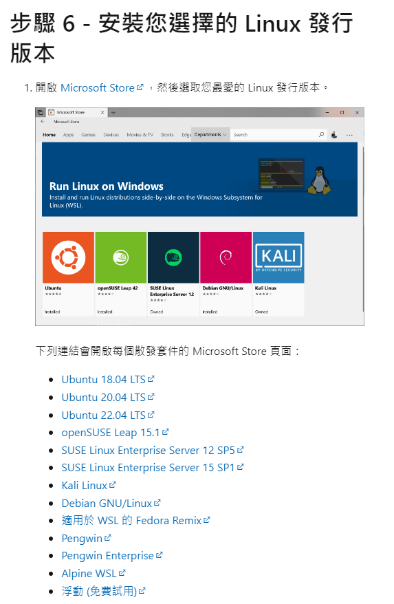

可從頁面的提示連結，或者直接使用你Windows中的Microsoft Store進行搜尋。

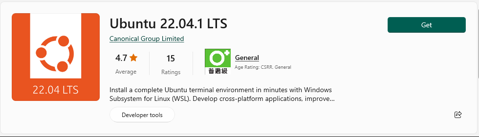

點選`Get`取得App，下載完成後，再點選`Open`開啟Linux核心，需要進行一些UNIX username的設定。請輸入帳號與密碼後，完成Ubuntu的初始設定。

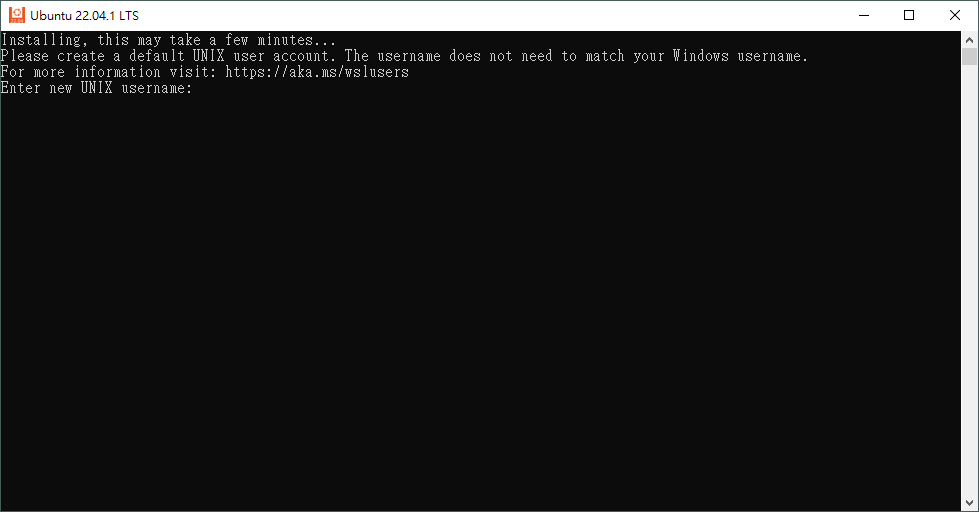

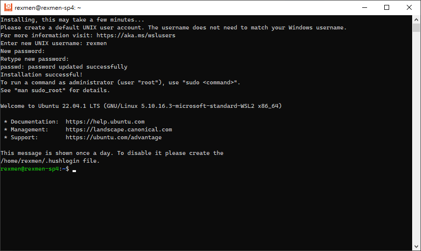

這個時候，你可以直接關閉上面的Ubuntu，我們回到剛剛敲wsl指令的PowerShell去。

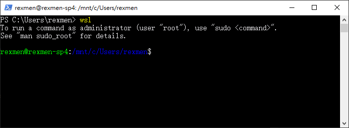

當安裝完Linux發行版本後，再打原本的wsl指令，會發內與剛剛的提示訊息不一樣了。到目前為止我們已經補完了一開始使用Docker Desktop卡關的地方，接著我們就可以重啟一下Windows了。


### 重啟Windows

我們重啟完電腦，這時候你可以再開啟PowerShell，並透過以下指令確認一下docker的版本。

```
docker version
```

但由於我們尚未把Docker的daemon啟動完成，因此會得到一些錯誤訊息。若我們將Docker的程式完整啟動後，再次下docker version指令才會沒有錯誤訊息。

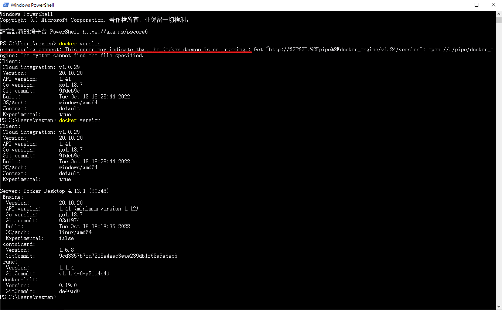


### 重新打開Docker Desktop軟體

當我們打開Docker Desktop時，左下角狀態會出現橘色的顏色，表示Docker Daemon尚未啟動完成。畫面上會出現Docker Desktop starting...的字樣，我們需要一些時間等待這個流程執行結束。

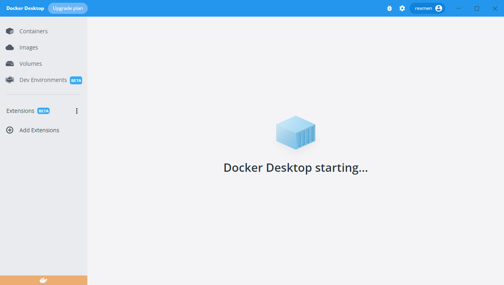

待我們成功完成啟動後，左下角的狀態顏色就會變成綠色，並且中間會提示我們如何開始運行Docker container。

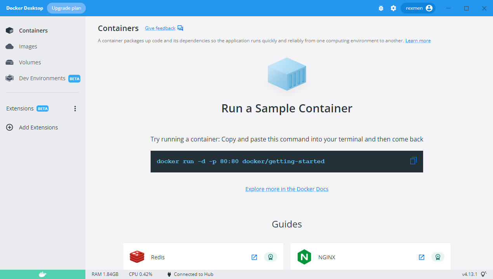

我們就複製一下畫面的教學指令指令，到PowerShell裡去執行：

```
docker run -d -p 80:80 docker/getting-started
```

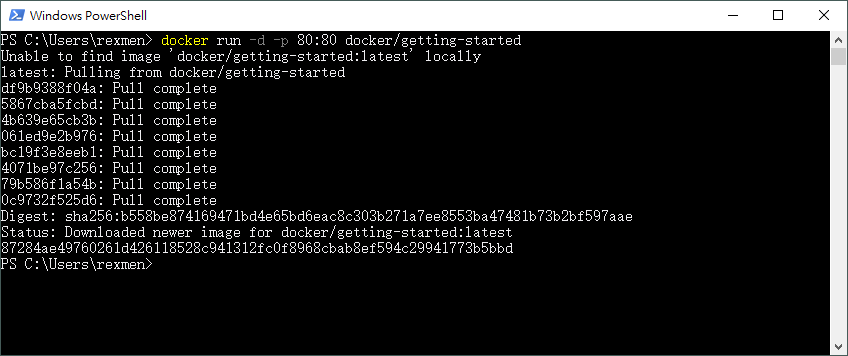

待執行完成後，我們再回到Docker Desktop中，就會看到我們已成功啟動第一個示範的Container了。

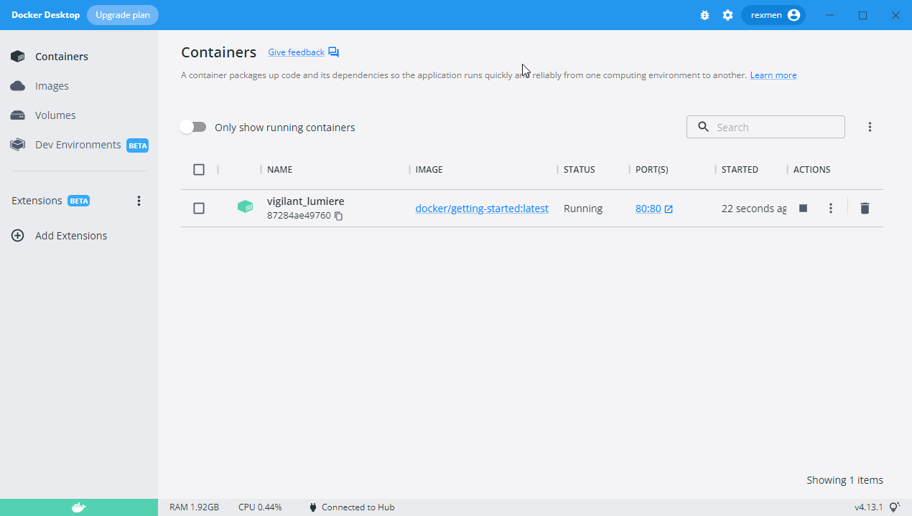

在`80:80`的地方有個超連結，透過UI可以很方便直接開啟瀏覽器連到Docker Container中所運行在80 Port的示範網站。

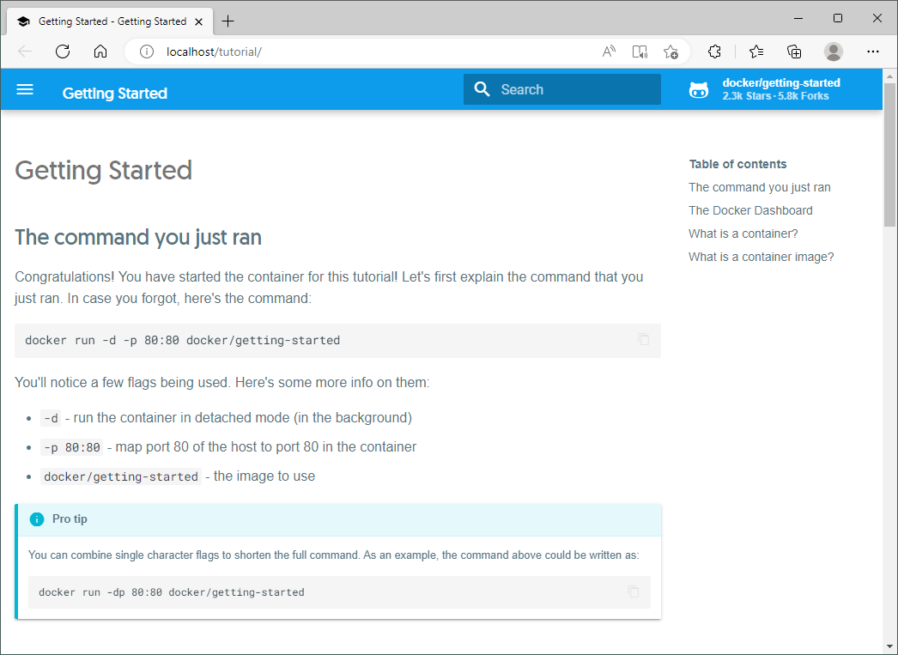

當看到上方的網頁時，就表示你完成了第一個最基礎的Docker示範了！我們可以到Images的區域看到這個docker/getting-started的Image的相關資訊。前面的Container就是由這個Image作為藍圖所建立出來的容器實例唷。

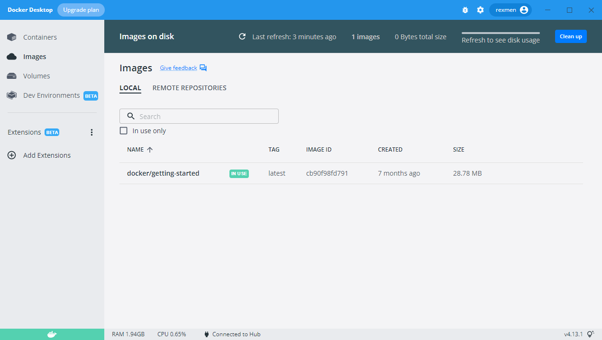

以上就是我們Step by Step的Windows版本Docker Desktop的安裝手順筆記與介紹。不過相信當時間一久後，Docker有可能會再針對Desktop作一些變化，屆時再來看這篇文章還適不適用了。


接下來就可以安心食用Docker囉！