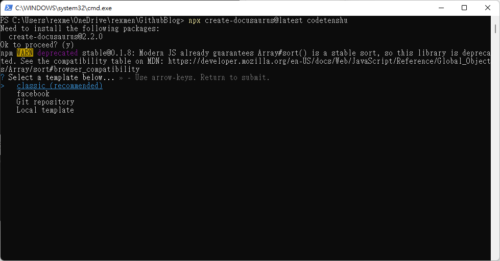
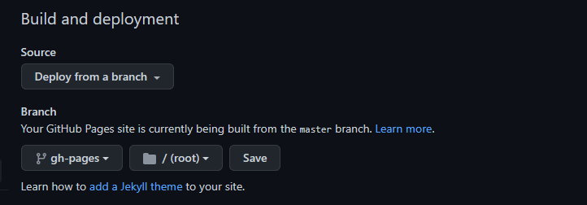

# 用Docusaurus搭配GitHub Pages建置免費個人部落格

先前介紹過一套靜態網站產生器 (Static Site Generator, SSG) — Jekyll，可完美搭配GitHub Pages使用，快速產生個人Blog建置。而今天要介紹另一套高效有趣的靜態網站產生器 — Docusaurus，有著相當可愛的恐龍Logo，他是由Facebook發起的開源專案 (正確說是Meta)。Jekyll使用的是Ruby作為建構基礎，而Docusaurus則是以node.js作為建置核心，若對node.js較為熟悉的朋友則可以快速的上手與使用。

## 特色

### 使用支援React的MDX Markdown語法

由於有Facebook的血統在，因此這套SSG很本能的可以與Meta自家技術React作擴充，結合了Markdown語法，算是Docusaurus的一大特點。

這裡所說到的，就是**MDX**，簡言之就是讓Markdown語法支援JSX，可以在Markdown裡引入元件，並有機會達成React的元件共用的優勢。有關MDX，可參考其[官網](https://mdxjs.com/)。這裡就不詳細說明，總之，Docusaurus除了單純撰寫Markdown的文件外，讓如果原本對React技術熟悉的人，可以有機會讓文件多出一些互動功能(例如互動圖表)的可能性。

<!-- truncate -->

### 進階功能

提供了版控、快速更換主題(theme)以及多國語系的設定配置與切換的能力。且支援了TypeScript，但如果純粹寫文章的話是可以不理會及使用。

### 可方便使用於GitHub Pages

Docusaurus可讓網站架設者將心思專注在撰寫文章上，因此只需要透過幾個簡單的指令，就能快速產生好靜態網站，而且他也有專門為GitHub Pages設計的指令，可分別將原始碼 (產生靜態網頁前的程式碼)以及產生好的靜態網站包分成不同的Git Branch，並上傳到GitHub Repo上，完美與GitHub Pages作整合。

### Docusaurus的靜態頁面架構

簡單說，在什麼都不改的情況下，他會快速幫你產生三種應用。

- Pages頁面
- Docs 文件區
  - 如果你的文章是有個大主題，且由多篇具順序性的文章組成，適合使用Docs來展現。
- Blog 部落格區
  - 如果你的文章以網誌方式呈現，強調發佈時間，且單篇獨立性，這樣就很適合使用Blog來展現。當然，但相同主題仍可使用tag群組分類。

## 小試身手，真的很簡單

首先你要先在電腦上安裝好node.js (16.14版本)，請至[官網](https://nodejs.org/zh-tw/download/)依個人電腦環境下載與安裝，接著就可以開始安裝Docusaurus了。

### 使用npx安裝指令

```bash
npx create-docusaurus@latest my-site
# 或者
npx create-docusaurus@latest my-site classic
```



後面若沒有帶template參數，則安裝時會需要選擇，預設建議使用`classic` (預設)。

若不使用TypeScript的話，則選擇`N`(預設)不套用。

### 啟動站台

等待安裝好後，則可進入剛建立好的my-site目錄且把站台跑起來。


```bash
cd my-site
npm start
```


> 如果你在一台新電腦上，把自己寫好的Docusaurus repo再clone下來時，要繼續執行上述的npm start，會出現`docusaurus: command not found`錯誤訊息，不用慌張，只需要執行`npm install`把package套件再下載安裝後就ok了。


### 連到產生好的靜態網站試試

直接到預設的 `http://localhost:3000/` 看結果


是不是超級簡單，就幫你把靜態頁面產生好了，再來就一步一步看如何在上面添加新的內容。

### Docusaurus的版本

目前官方已正式推出v2版本，而且已正式宣告v1版會被廢止，因此請直接使用v2版。兩個版本的主要差異在於v2版不支援IE 11，如果必須支援IE 11的話，就需要回頭使用v1版本 (雖然官方不建議)。

另外是v2版本支援SPA (Single-Page Application)，v1是不支援的。

官方有針對v1移植到v2的指引：[https://docusaurus.io/docs/migration](https://docusaurus.io/docs/migration)

不過因為我沒用過v1版，所以細節也就不多作研究了。

## 其他特點

其他Docusaurus的特點包括如下：

- 支援較好的SEO
- 網站內容是可被搜尋的
- 支援快速切換日夜閱讀模式
- 基於JAMstack (JavaScript, API, Markup) 靜態網站架構
- 支援TypeScript

## 目錄結構

```bash
my-website
├── blog
│   ├── 2022-10-28-greeting.md
│   ├── 2022-10-29-hello-world.md
│   └── 2022-11-30-welcome.md
├── docs
│   ├── doc1.md
│   ├── doc2.md
│   ├── doc3.md
│   └── mdx.md
├── src
│   ├── css
│   │   └── custom.css
│   └── pages
│       ├── styles.module.css
│       └── index.js
├── static
│   └── img
├── docusaurus.config.js
├── package.json
├── README.md
├── sidebars.js
└── yarn.lock
```

- blog目錄
  - 底下擺放的是blog文章，使用`YYYY-MM-DD-my-blog-post-title.md`方式命名。
- docs目錄
  - 擺放文件內容，預設會在左邊自動依文章產生側邊欄的超連結。但若對左列的文件結構或順序等有自己特別的擺放方式，則可在sidebar.js檔調整。
- src目錄
  - 所有非文件式的檔案可放在這個目錄，例如單頁式page或者React的元件。而在其pages子目錄底下放的Markdown、MDX、TSX檔都會被轉為頁面。
- static目錄
  - 底下放置的是靜態的資源檔，這個目錄的檔案在進行Docusaurs建置過程時，會被複製到build目錄下。

## 寫寫新文章

針對以上的目錄結構，可自行撰寫幾個測試的頁面，擺放在blog、docs底下。若不需要的檔案則可以自行刪除。

### 設定文章時間

文章最重要的是必須要設定文章的時間，在blog區的排序，也會依據文章所定義的時間進行排序。(越新的文章放越上面)

```markdown
---
date: 2022-11-13T08:00
---
```

### 設定全域作者

當你要撰寫blog時，會希望上面有作者(當然可能就是你本人而已)的資訊，在每一篇blog撰寫時可以直接填寫相關作者資訊，但這樣的方式顯的很不程式化。

在某篇文章my-blog-post.md的最上頭：

```markdown
---
authors:
  name: Joel Marcey
  title: Co-creator of Docusaurus 1
  url: https://github.com/JoelMarcey
  image_url: https://github.com/JoelMarcey.png
  email: jimarcey@gmail.com
---
```

若是有多名作者的話可以使用下列寫法：

```markdown
---
authors:
  - name: Joel Marcey
    title: Co-creator of Docusaurus 1
    url: https://github.com/JoelMarcey
    image_url: https://github.com/JoelMarcey.png
    email: jimarcey@gmail.com
  - name: Sébastien Lorber
    title: Docusaurus maintainer
    url: https://sebastienlorber.com
    image_url: https://github.com/slorber.png
---
```

Docusaurus提供了一個全域作者設定檔，可以先行設定，之後在撰寫文章時只需要將作者key寫上後，就會對應到設定檔的完整資訊了。設定的方式如下：

於/blog/authors.yml

```yaml
jmarcey:
  name: Joel Marcey
  title: Co-creator of Docusaurus 1
  url: https://github.com/JoelMarcey
  image_url: https://github.com/JoelMarcey.png
  email: jimarcey@gmail.com

slorber:
  name: Sébastien Lorber
  title: Docusaurus maintainer
  url: https://sebastienlorber.com
  image_url: https://github.com/slorber.png
```

可改寫剛剛直接在作者的資訊展開的寫法，直接以定義好的作者key放入即可：

```markdown
---
authors: jmarcey
---
```

也支援多名作者，則加上陣列的方括號：

```markdown
---
authors: [jmarcey, slorber]
---
```

### 其他文章資訊

還可對文章加上標通、描述、Tags。

```markdown
---
title: Welcome Docusaurus v2
description: This is my first post on Docusaurus 2.
tags: [hello, docusaurus-v2]
image: https://i.imgur.com/mErPwqL.png
---
```

## 建置靜態網頁

如果不使用建階的功能，則可以先嘗試簡單建置一下，看看產出的結果。

使用以下指令：

```bash
npm run build
```

而執行完後，會產生靜態網頁的產出目錄`build`。該目錄的內容，是一個純粹的靜態網頁結構，因此你可以複製到任何不帶有後端渲染引擎的伺服器上建置。

不過如果要使用GitHub Pages的話，因為他本身是一個受Git控管的repo，因此像這類經編譯程式從原始碼產生出來的檔案 (就像這裡的build目錄以及其下的文件)，多半不會作程式碼版控。因此最好的作法，是透過Docusaurus所提供的GitHub Pages的設定以及佈署工具。

在docusaurus.config.js檔案設定：

```jsx
module.exports = {
  // ...
  url: 'https://endiliey.github.io', // Your website URL
  baseUrl: '/',
  projectName: 'endiliey.github.io',
  organizationName: 'endiliey',
  trailingSlash: false,
  deploymentBranch: 'gh-pages',
  // ...
};
```

以上的配置，是使用GitHub Pages的預設專案來設定，也就是repo的名稱是「`{username}.github.io`」。

### 透過專用的指令建置

接著，使用專用指令進行GitHub Pages的建置：(以Windows為例)

```jsx
cmd /C "set "GIT_USER=<GITHUB_USERNAME>" && yarn deploy"
```

Mac的話，可使用以下指令

```
GIT_USER=<GITHUB_USERNAME> yarn deploy
```

若出現了以下錯誤，則將GIT_USER加入ENV環境變數中

```
[ERROR] Error: Please set the GIT_USER environment variable, or explicitly specify USE_SSH instead!
```

```
export GIT_USER=<GITHUB_USERNAME>
```

透過上述指令，會進行建置，預設會將原本Docusaurus的原始檔，發佈到`main` branch底下，而產生的靜態頁面的原始檔，則會發佈到`gh-pages` branch底下。


### 調整Github上的Repo Settings

要選擇發佈的Branch，從`master`改到`gh-pages`。如果忘了改，使用`master`的話，是無法看到build後的網頁內容的。



調整後，記得按下`save`，需等一點點時間才會起作用。

如果你可以看到自己的blog出現在自己的GitHub Pages，就大功告成囉！


## 補充：之後新的文章或修改舊文章

若之後撰寫新的文章，或修改舊文章，可以直接調整.md檔的內容後，再執行上述的yarn deploy指令，則會自動發佈已產生的內容，直接蓋掉gh-pages的內容 (大概需要10秒鐘)。這個動作和你的原始檔修改後是否要進行git commit & push是無關的。


簡單說，你現在有兩個branch，一個是master，主要掌管的是你自己文章的Git版控。另一個是gh-pages，掌管的是你所build完後產生的SSG靜態內容。


因此當你寫新文章或修改文章後，你必須要把這兩個動作都完成，才會確保你Github pages上的blog文章呈現也是最新的，你的文件原始碼也一併更新至最新狀態。