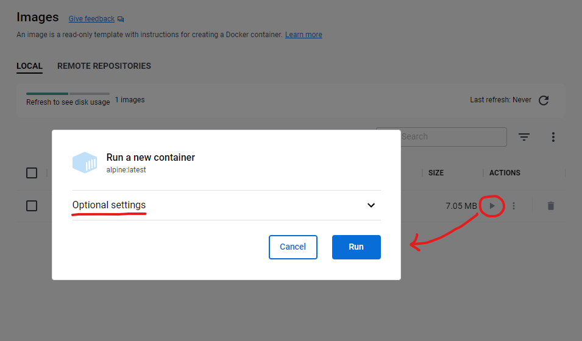
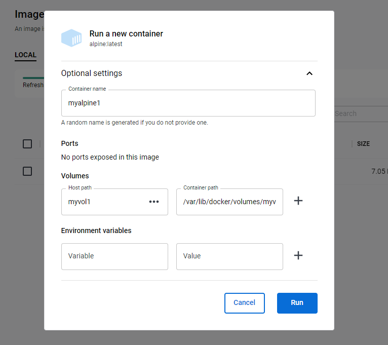
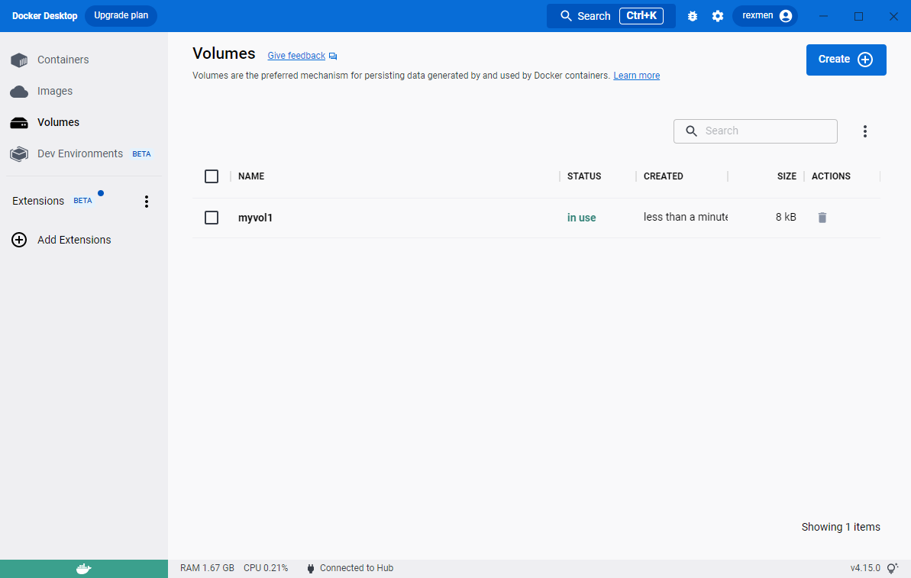
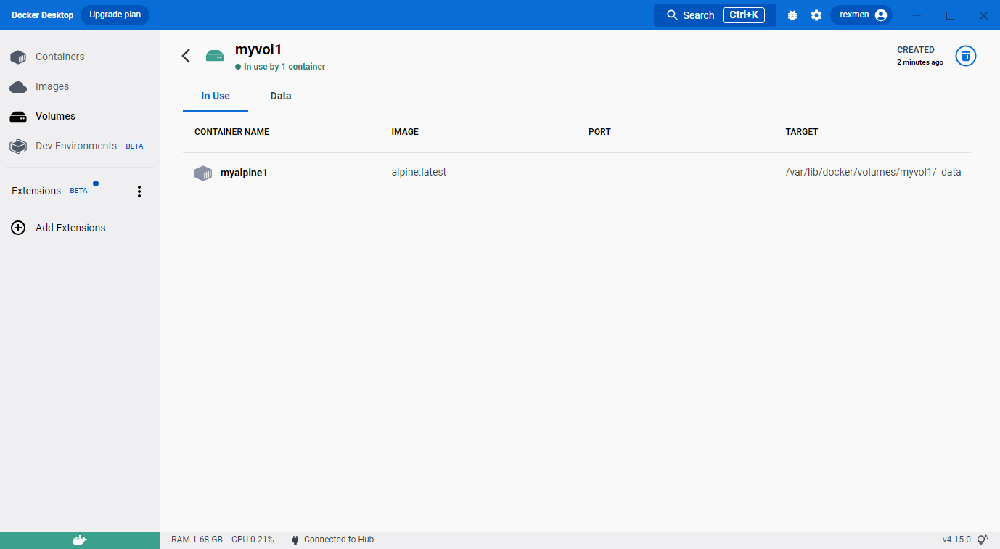
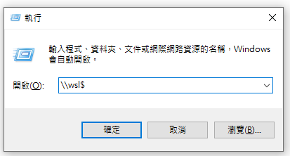
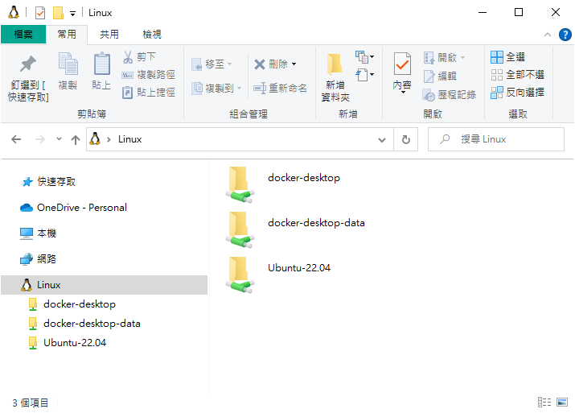
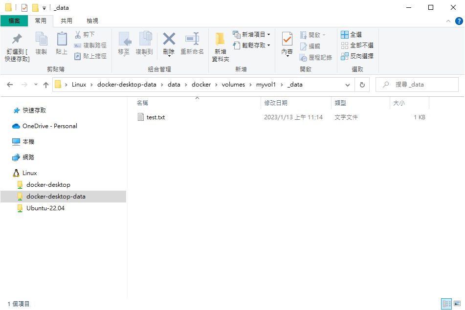
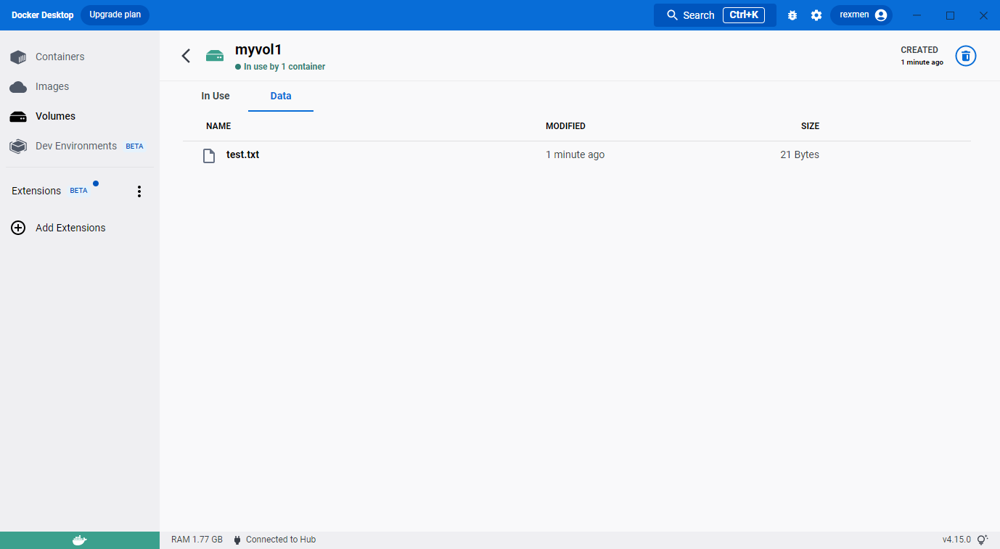
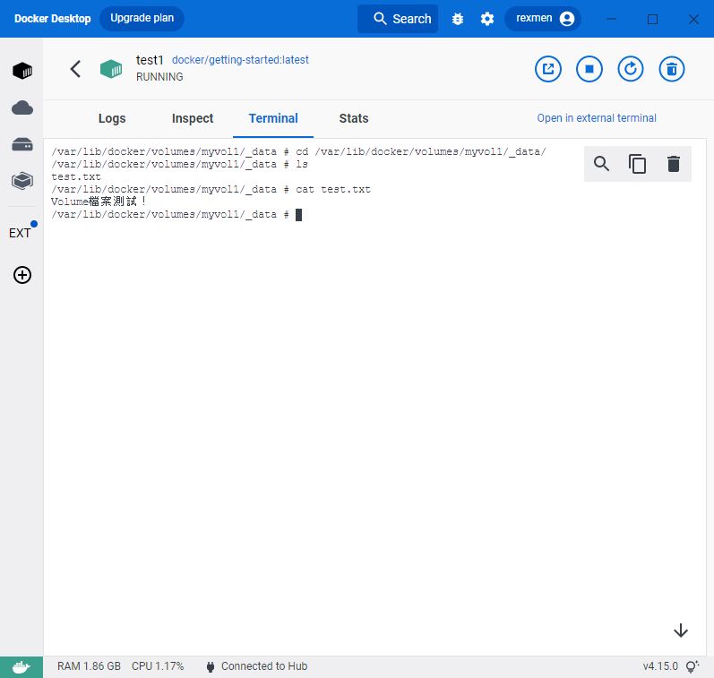

在上一篇[《Docker Desktop 安裝筆記 (Windows 版本)》](/blog/2022-11-7-docker-01)文章說明了 Docker Desktop 的安裝，現在要來聊聊 Docker Desktop 能做些什麼事。

> 上一篇講軟體安裝的版本是 4.13.1 版，沒多久就出了更新版到 4.15.0 版，除了介面小幅調整之外，也多了不少功能。之前覺得 Docker Desktop 其實功能挺少的，大多的好處會在使用漂亮的 GUI 來查看資訊而已。必須說，Docker Desktop 真的改版速度飛快，三天兩頭就跳出要更新版本的訊息。

## 先聊一下 Docker 的重要要素

在 Docker 的容器化架構中，對於完全不了解的人來，快速的講解一下。你需要知道的幾個重要的要素：

- **Images**

- **Containers**

- **Volumes**

#### Image

Image 可以想像成是一個唯讀的模板，好比是從網路上下載下來的一個軟體的安裝檔。即使相同的軟體，可能也有不同的版本之分，Image 就是這樣的概念，主要是作為容器化的樣板來源。

> Image 是怎麼來的呢？要先建立 Dockerfile 檔，此檔案定義如何建置的過程需要哪些內外部資源以及描述建置流程的細節。不一定要全部從零開始，大多數是基於某些 Image 再進行疊加或調整。

#### Container

Container 就是以 Image 作為樣本基礎，去實際運行出來的實體成品，也可以視為是一個 App 應用程式。與 Image 的關係，就好比拿某一個安裝檔安裝完後的可執行應用程式。如果你把一個 Image 檔進行 5 次容器化，你就會得到 5 個不同實體的 Container 環境(即使內容相同)，由此可想像的到 Container 才會是我們所有運行容器化的主角真身。

#### Volume

而 Volume 的概念就是實際儲存的空間，可以掛在 Container 上使用，即使 Container 被移除，Volume 還是可以存在。可以想像成 Container 是被安裝完成的執行程式，但 Volume 是獨立的資料儲存位置，即使程式被移除後，還是能保留 user 資料。

有了上面的參的觀念後，就可以知道 Docker Desktop 的視覺化呈現，主要是為了要幫我們更直覺的管理或檢視上面這三個要素。

當然，不使用 Docker Desktop，純粹使用 Command Line 指令也都可以作到上述的管理。

## 來看一下 Docker Desktop 的功能吧

左側是主要功能區，可看到 Containers、Images、Volumes，下面還有兩個是 Beta 功能，分別是 Dev Environments 開發環境配置功能以及 Extensions 外掛管理。


我們先把重點放在 Docker 御三家吧!

# Images

雖然 Containers 擺在最上方，但我們要從第二個 Images 開始看，因為他是一切容器化流程的首站。


一進到 Images 區時，應該會有一點不知要從何下手，因為也沒看到如何找到既有的 Image，也沒辦法在這裡建立 Image，沒有任何看起來比較直觀的功能按鈕可以使用，就會愣在這裡一會兒。

原因是因為必須要搭配 Terminal 的 Command 指令進行 Image 的 pull 或 run。這實在很不直覺，如果都有整個 Desktop 環境了，為什麼不能從 GUI 來執行人性化一點的流程就好。原本先前版本的 Docker Desktop 是這樣沒錯，但新版有了一些突破了。

我們以名為`docker/getting-started`的 Image 為例，如果我們要 pull 下載這個 Image (先不進行容器化)，要開啟 Terminal (在 Windows 的話，就執行 cmd 或者 powershell)

```bash
docker pull docker/getting-started
```


遠端 pull 下載完成後，這時候就會在 Images 區看到了。


### 新功能！線上 Images 搜尋功能

之前的搜尋功能只能針對你自己 Local 本機或 Remote Repo (需連結帳號)的 Image 或 Container 進行「過濾」的搜尋。新版本在主視窗上方多了 Search 搜尋功能 (按下`Ctrl + K`)，在裡面終於可以搜尋 online 版本的 Image 了！


我們一樣，直接點選`pull`進行下載，即可在 Images 區看到一樣的結果產生。

### 新功能! Image 詳細頁 (含資安漏洞分析)

這個功能應該是從 4.14.0 新增的，在 Image 列表點進去內頁後，可看到比舊版多出不少功能。


#### Image 階層

首先左邊可以看到 Image 的階段關係與 Layer 層結構，可以更直覺的了解 Image 的來源有哪些，以及 Dockerfile 在 Build 時的指令執行順序。

#### 弱點分析

右側會將各種資安相關的漏洞依不同方式整理，也可以展開再看到更多的細節。

第一個是依 Images 的繼承父子關係列出相關的資安摘要資訊，依照風險等級(C 危急, H 高風險, M 中風險, L 低風險)會有不同的顏色區分。


接著可以漏洞作分類，直接幫我們整理好，還可展開看到漏洞的細節。還貼心的幫我們把公開漏洞資料庫的連結都準備好了，點開就可以看到完整詳細的頁面。


當然，這些資料的來源是從 NIST 過來的，上方仍然貼心的把原始的 CVE 內容再附上，讓使用者可以快速確認相關的詳細來源資訊。


接著是 Image 中的所有 packages 套件列表，一樣可展開看到更多的細節內容。


上述的這些新功能，真的是蠻有感而且實用的，至少讓 Docker Desktop 的實用性與不可取代性增加了不少，先前很多人會認為只要會 Docker 的 Terminal 指令，Docker Desktop 真的只是非必要性的輔助工具，所以在先前從免費軟體變成需付費的消息一出，很多人評估後直接棄之不用。


### 執行Image

若我們要將image運行起來成為container，一種是在Image不存在本機時，直接用run指令，一併先pull下載再順便run成container。另一種方式是原本已存在本機的image，可在之後對它下run指令再運行新的container。


不過不得不抱怨一下，Docker Desktop的run功能真的作半套，功能相當陽春，基本上不太能因應需求。**<mark>在Docker Desktop，不能夠透過設定來設定額外的執行參數！</mark>**

所以，如果執行時，想要帶入什麼port mapping、背景daemon執行或互動模式等，是不能達成的！只能透過Terminal的方式輸入，這真的讓我覺得相當納悶，要做到這樣的功能對Docker Desktop的開發團隊來說絕非難事，但就是沒有。也許未來幾版會有這樣的功能也不一定。


以下以alpine:latest進行Image的設定。(可使用`Ctrl+K`搜尋)



點選image的play鍵即可執行Run指令，基本預設是不帶其他設定，Docker Engine會自動以預設方式亂數幫你產生container name。


若我們展開`Optional settings`後，會到可對Container name、Ports mapping、Volumes、Environment variables進行設定。

#### 設定Volumes

在設定volumes時，要選擇本機Host的路徑 (Host path)以及container上的掛載路徑 (Container path)。


在本機路徑中，可以點選`…`在本機端選擇你想要掛volume的路徑，不過這個方式設定完的volume不會出現在Docker Desktop Volumes區！無法從那邊再進行管理。

若想要在Volumes區可被看到，則記得不要填路徑，而是輸入一個「名稱」作為volume name，這樣才會在volumes區出現。但你可能會好奇，這樣建出來的本機路徑在哪裡？



點選進去詳細資訊後，可看到被使用在哪一個container以及container上的位置。



也可以從container的詳細資訊中，在Inspect區看到volume的綁定。


#### 那本機的Volumes目錄到底在哪裡？

若你使用Windows (我只有Windows，Mac的使用者要自己研究一下了，或哪天我使用Mac再來更新)，可開啟檔案總管或者使用`Win+R`執行，輸入以下指令：

```powershell
\\wsl$
```



另一個方式，因為在Windows中有安裝WLS的關係，在檔案總管其實可以看到Linux的磁碟icon，可以連結到一樣的地方。



其中，再進到docker-desktop-data。再進到data、docker、volumes就能看到剛建立的volume了。

更直接的路徑在此：

```
\\wsl$\docker-desktop-data\data\docker\volumes\
```

以我剛剛的myvol1為例，進到裡面後可以建立一個檔案。



這時候我再回到Docker Desktop的Volumes詳細資訊的`Data`區，就會看到裡面有這個檔案了。



為了要直接在Container中驗證，我們得讓Image在Run的時候是以背景執行方式運行Container，我們可以重新再使用一下先前用到的`docker/getting-started`這個Image，因為這個image有進行背景運行的設定，以方便我們使用terminal連入確認Volume的狀態。


我們進到Terminal區後，透過以下指令確認我們掛上去在本機端的Volume檔案及內容，都可以在container中存取到。

```bash
cd /var/lib/docker/volumes/myvol1/_data/
ls
cat test.txt
```




這樣大家是否會使用簡單的Docker Desktop的功能了呢？我個人覺得他的功能有一點不是那麼豐富，雖然介面設定的很簡潔，但更期待的是他能夠將更多terminal指令的功能UI化，這樣才能真正更有效率或直觀的管理容器。
