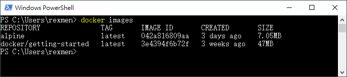
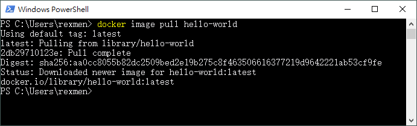
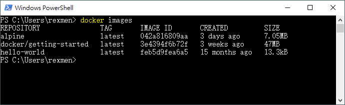
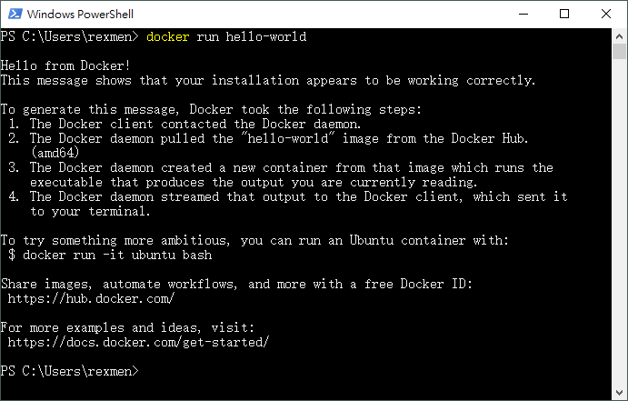
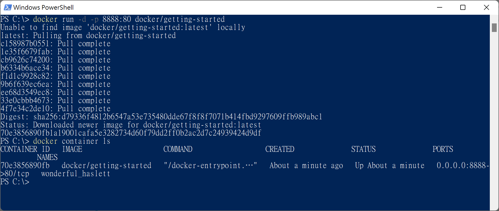
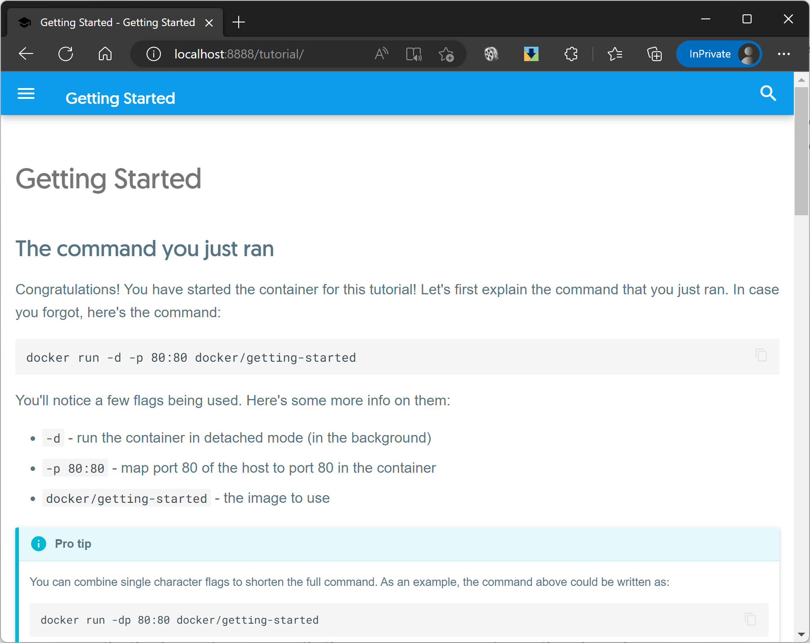
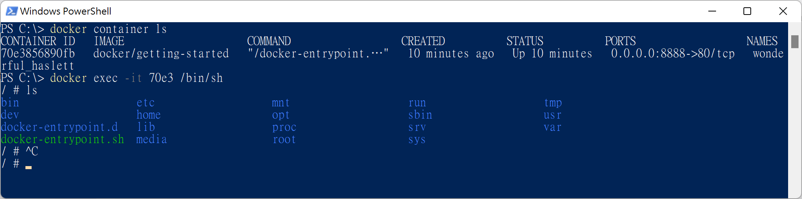
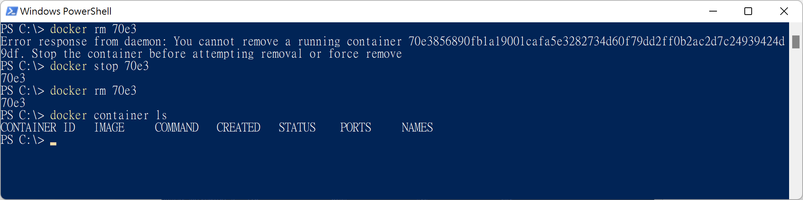

我們在上一篇文意[《Docker Desktop新手教學》](/blog/2023-01-12-docker-02)中了解了如何透過Docker Desktop GUI快速操作與檢視容器，但也了解到其實視窗化的Desktop工具功能不是很齊全，許多功能是沒辦法在上面一次完成的。這篇開始要來談docker的指令集，可以從terminal中直接下完整的指令來進行各種容器的日常作業。

當然，使用terminal進行指令式的作業流程，一樣可以開著Docker Desktop進行快速又直接美觀的即時檢視或管理，也是一個不錯的搭配運用。

## 從查詢docker版本開始熱身

當安裝完docker engine後，可以在本機的terminal工具先進行一下確認，通常可以嘗試列出docker的版本。

```docker
# 簡要版查詢version
docker -v
docker --version


# 完整版查詢version資訊
docker version
```

我的目前使用的是version 20.10.21

也可以順便查一下docker-compose的版本

```git
docker-compose -v
docker-compose version
```

## Image映像檔

接著就可以從Image開始了解起。

### 看看Images資訊

先前介紹過image與container之間的關係，要執行容器化container之前，我們一定要先有image。先查看目前本機有哪些images吧

```docker
docker image ls

# image加複數s
docker images
```



查詢出來會列出幾個欄位：

| 欄位         | 說明                                                                         |
| ---------- | -------------------------------------------------------------------------- |
| Repository | 列出在雲端Docker Hub上的Repo名稱以及Image名稱，使用`/`分隔。                                  |
| Tag        | 主要記錄版本，若最新版則為latest。                                                       |
| Image ID   | 若要對我們目前的image作操作時，ID可代表唯一性。不過Docker在操作時，不用輸入完整的ID，只需要輸入前幾碼即可，前提是只要能識別出唯一性。 |
| Size       | 這個Image所佔的檔案大小                                                             |

### Pull! 抓取新的Image試試

試著抓取hello-world Image來試試看

```docker
docker image pull hello-world
```



若是該image不存在，則會從雲端的Repo進行下載。再重新進行images查詢，可以看到已列在列表中。



但剛的狀態僅僅是抓取下來，並未運行成container，所以下一步就是要來試著執行容器化的動化。

更完整的pull語法如下，如果有需要針對特定的版本號碼，要在image後加上冒號以及版號，預設都不加的話就是latest版本。

```docker
docker pull <repo_account>/<image_name>:<tag>
```

#### 如何刪除Image?

如果要刪除image，可使用以下語法：

```docker
docker image rm <image_name 或 image_id>
docker rmi <image_name 或 image_id>
```

不過預設情況，只要有container還關聯著此image的話，就不能直接對此image作刪除。

若是想要暴力刪除此image的話，就要加上`-f`的參數。不過此作法是在於有container沒有運作中，但關聯著image的情況。如果該container正在運作中的話，則必須先停止運作才行。(後面會解說)

```docker
docker image rm -f <image_name 或 image_id>
docker rmi -f <image_name 或 image_id>
```

#### 小技巧

使用docker有ID類的(無論Image或Container)，不需要輸入完整的ID。只要你輸入的頭幾碼足以識別出唯一性即可，所以為了增加管理效率，可以只輸入3~4碼即可。

### Run! 運行成container狀態吧

通常如果你要將一個Image直接運行成container，可以使用`run`指令，就會也包含了剛剛的`pull`動作。不過在此需注意的是，run是container的指令，並非image的。但執行run的時候，container是可以省略的。

```docker
docker container run hello-world
docker run hello-world
```



這個hello-world只是作為docker運行成container的基礎測試，他沒有什麼特別的功能，只要能看到上述的內容就代表運行成功了。上面的內容除了解說運行的流程外，還外加提示，你可以嘗試使用互動式指令來運行一個ubuntu的container。

### 查詢container列表

查詢目前所有的container列表，有下列幾種方式。

```docker
# 查詢執行中的container
docker container ls
docker ps

# 查詢所有的container
docker container ls -a
docker ps -a
```

若我們想要直接列出所有的container的ID，可以加上`-q`參數，後面會講解這個能做什麼用。

```docker
docker container ls -aq
docker ps -aq
```

### 跑一個有感覺一點的container吧

剛上面的hello-world在一執行完後就會立刻結束，即使container還存在，但無法對他進行進一步的互動操作或使用。所以我們可以來運行一個簡單的web server，讓這個container可以持續運行，並且可以使用本機瀏覽器來拜訪首頁。

我們嘗試使用以下指令來執行，port的對應8888可自行修改成你要的。

```docker
docker run -d -p 8888:80 docker/getting-started
```



接著使用瀏覽開啟 http://localhost:8888/ ，這個測試網站就是從剛剛的container提供的web伺服器服務。



上述加上了`-d`的參數，這裡實際上代表的原意是`detach`模式，表示可將container以背景服務方式運作。但一般多半會將這個d解釋為Linux的daemon。或許是一種誤用，但其實理解上還蠻相近的。

#### 連入操作container

我們剛剛運行的是以-d的daemon模式運作，所以他會常駐執行起來，但我們如果想要連入操作要怎麼做呢？

可以使用`exec`加上`-it`的參數，再指定要使用的shell程式`/bin/sh`後，就能針對該container作操作。

```docker
docker exec -it 70e3 /bin/sh
```



#### 刪掉剛剛的container

有建立就要有刪除，我們試著用以下指令刪掉container。

```docker
docker container rm 70e3
# 或省略container，預設就是對container操作
docker rm 70e3
```

但在進行操作時，會被告知這個container還在運行，要先停止他。

可再使用stop指令停止這個container後再進行刪除。

```docker
docker stop 70e3
```



不過如果你想無視他是否執行，都要刪掉這個container，如同刪除image一樣，加上`-f`後就能暴力刪除container了。

```docker
docker rm -f 70e3
```

#### 一次對全部container操作

若我們想要一次停止或刪除多個container，可以在後面的ID處以空格格開多個。

```docker
docker stop 70e3 af32 b12f
# 或
docker rm 70e3 af32 b12f
```

但如果我們想要一次把所有的container全部都停止，則可以使用上面講到的-q參數，只列出Container ID後，再把他們當成變數餵給stop或rm等後面的參數。請注意，這個作法在Windows cmd是無法使用的，需使用powershell。

```docker
docker container stop $(docker ps -aq)
docker container rm $(docker container ls -aq)
# 當然前面的container也可省略
docker rm $(docker ps -aq)
```

#### 想要一開始run起來時就順便連入操作

另外補充一下，若是想要在一開始run起來的時候就連入container作操作，可以在run的指令就加上-it與/bin/sh的參數。我們以超輕量的linux image -- alpine作為示範。

```docker
docker run -it alpine /bin/sh
```

> 早期版本alpine只能使用/bin/ash，現在可以使用/bin/sh了。

這裡的`-it`參數，實際上代表著`interactive`以及`tty`。由於alpine本身沒有預設執行任何可常駐在背景服務的程式，所以若下了`-d`服務，想說之後再使用`exec -it`方式連入是會沒效用的。(無效果的是`-d`參數)

上述簡要的說明如何使用docker engine的指令模式來操作image、container，如果有安裝docker desktop的話，還可以輔助的一起使用，也是蠻方便的。
