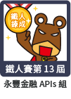

## 寫在前面
這是我第一次參加iThome鐵人賽，參加2021年的【永豐APIs組】，最後完賽並取得該年度的【佳作】成績。

### 《錢進！永豐金融APIs程式串接實戰最前線》

此系列文章也可到[iThome](https://ithelp.ithome.com.tw/users/20130354/ironman/4859)看喔！

永豐金控旗下的永豐銀行與永豐證券，提供了完整且豐富的APIs供程式系統進行彈性且符合客製化需求的串接能力，範圍涵蓋與個人生活相關的消費支付、生活繳費、身分認證與開放銀行等服務，也針對個人證券投資開放自動化及時程式下單的各種擴展功能！一起摩拳擦掌，挽起袖子，前進永豐金融APIs的世界吧。